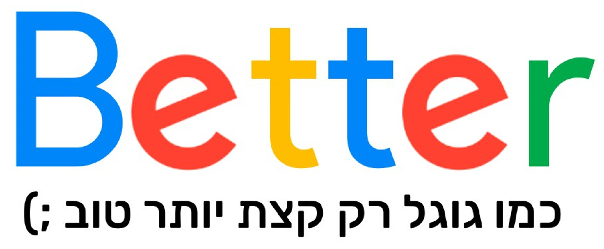
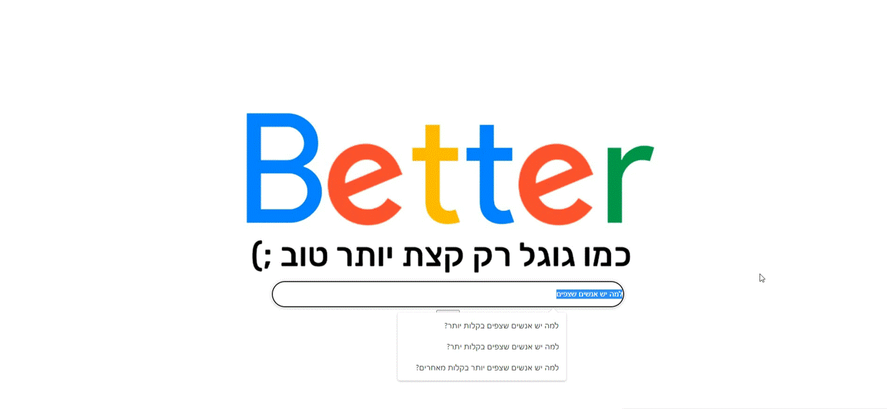

## Better search
a better search system than searching in Hebrew on Google.

Usually when the search on Google is done only in the language in which the user asked the question.
In this way, the user is prevented from many answers that can be found in different languages.

In our search, we bring to those who are looking for a question in Hebrew an answer also from the search on English websites.

How It Works?

in four steps:
1. Translation of the user's question from Hebrew to English
2. Search for the question in English
3. Receiving an immediate answer in Analyt (if any)
4. Translate the answer back into Hebrew.

All this is done in a python api that we built here:
- [Better search api](https://github.com/Orkessler/Better_search_API)

Our project was built in react, js, css

## Demo
When I search on Google:
"Why do some people float more easily than others"
It can be seen that it is difficult to find an answer.
Searching our website has a clear answer (translated from English).

You can also see a situation where there is no answer to the search even in English (such as searching for the name of a street) where the user does not lose because we always add the Google search results in the iframe.

--

## Authors

- [Ori Kessler](https://github.com/Orkessler)
- 
## Languages and Tools:

            

